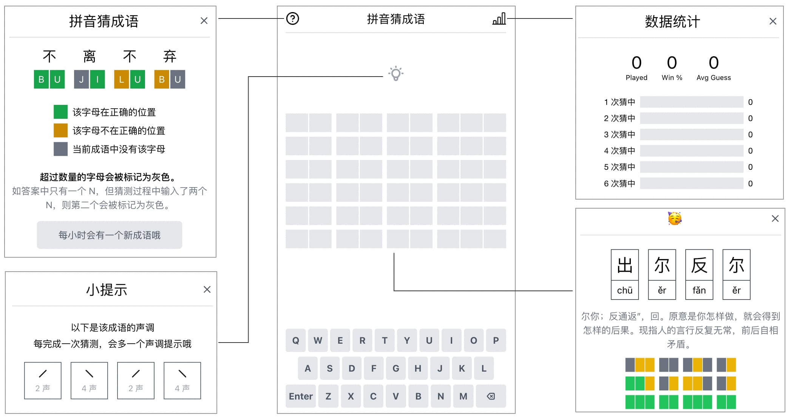
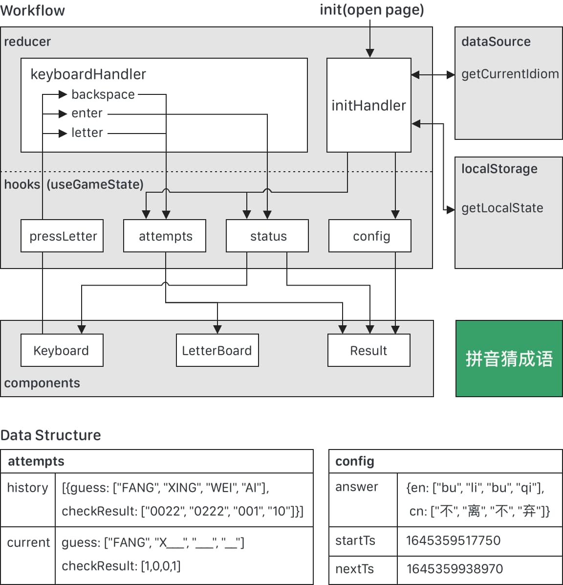

## 简介

[拼音猜成语](https://pinyincaichengyu.com)是一个受 [Wordle](https://www.nytimes.com/games/wordle/index.html) 启发的一个中文成语小游戏，通过输入拼音组合，结合系统给出的提示来一步步猜测给定的成语。


## 技术栈

- [React](https://reactjs.org) (via [Create React App](https://create-react-app.dev/))
- [immutability-helper](https://github.com/kolodny/immutability-helper)
- [Jest](https://jestjs.io/)
- [React Testing Library](https://testing-library.com/docs/react-testing-library/intro/)
- [Storybook](https://storybook.js.org/)

## 设计

核心设计思想是将需要的数据通过 `Provider` 提供，其他模块可以按需来获取对应的数据



```js
export function AppProvider(props) {
  const value = {
    ...state,
    pressLetter,
    storeService,
  };
  return <AppContext.Provider value={value} {...props} />;
}
```

```js
// 精简后的 App.js
<AppProvider config={config()} storeService={localStorage}>
  <Board />
  <Keyboard />
  <Result />
  <Help />
  <Statistics />
</AppProvider>
```

```js
export default function Board(props) {
  let { attempts, config } = useAppContext();
  // consume attempts, config
  // ...
}
```

## License

[MIT](LICENSE) License © 2021-PRESENT [Limboy](https://github.com/limboy)
